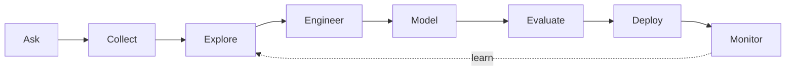

<div align="center">

<picture>
  <source media="(prefers-color-scheme: dark)" srcset="./assets/header-dark.svg">
  <source media="(prefers-color-scheme: light)" srcset="./assets/header-light.svg">
  
</picture>

<br>

<a href="https://git.io/typing-svg">
  
</a>

<br><br>


</div>

## `SYSTEM.INFO`

```yaml
name: Vibhansh Vats
location: India
role: Data Scientist & Machine Learning Engineer
mission: Turn raw data into useful insights and production-ready ML systems
interests:
  - Predictive modeling and time-series forecasting
  - Deep learning and natural language processing
  - Financial analytics and quantitative modeling
  - Exploratory data analysis and feature engineering
currently:
  learning: Production ML, model monitoring, and scalable data workflows
  building: Practical products where data, engineering, and user experience meet
```

## What I work on

| Area | What I build | Tools |
|---|---|---|
| Machine Learning | Classification, regression, recommendation and evaluation pipelines | Python, Scikit-Learn, XGBoost, LightGBM |
| Deep Learning & NLP | Neural networks, text processing and intelligent applications | PyTorch, TensorFlow |
| Analytics & Forecasting | EDA, feature engineering, time-series and financial analysis | Pandas, NumPy, Statsmodels |
| Data Systems | Querying, storage, ETL and scalable processing | SQL, PostgreSQL, MongoDB, Spark |
| ML Engineering | Reproducible experiments, containers and developer workflows | MLflow, Docker, Git, Linux |

## Featured projects

<table>
<tr>
<td width="50%" valign="top">

### [Tradeverse](https://github.com/vatsvibhansh-cmd/Tradeverse)

Stock and trade analytics platform for exploring market behavior, technical indicators and financial trends.

`Financial Analytics` `Time Series` `React` `MongoDB`

</td>
<td width="50%" valign="top">

### [EduLearn](https://github.com/vatsvibhansh-cmd/EduLearn)

AI-powered career guidance platform designed to turn learner information into useful recommendations.

`Machine Learning` `Recommendation` `Next.js` `Node.js`

[Live application →](https://edu-learn-ashy.vercel.app/)

</td>
</tr>
<tr>
<td width="50%" valign="top">

### [Bajao](https://github.com/vatsvibhansh-cmd/Bajao)

Music streaming experience combining modern web development with user-preference data.

`Next.js` `Node.js` `MongoDB` `Analytics`

[Live application →](https://bajao-94ld.vercel.app/)

</td>
<td width="50%" valign="top">

### End-to-End ML Lab

A growing space for reproducible experiments—from data validation and feature engineering to evaluation, deployment and monitoring.

`Python` `MLflow` `Docker` `MLOps`

Coming next.

</td>
</tr>
</table>

## Data science toolchain

<div align="center">


<br><br>


</div>

## From data to model



## GitHub activity

<div align="center">


<br>


<br>

<picture>
  <source media="(prefers-color-scheme: dark)" srcset="https://raw.githubusercontent.com/vatsvibhansh-cmd/vatsvibhansh-cmd/output/github-contribution-grid-snake-dark.svg">
  <source media="(prefers-color-scheme: light)" srcset="https://raw.githubusercontent.com/vatsvibhansh-cmd/vatsvibhansh-cmd/output/github-contribution-grid-snake.svg">
  
</picture>

</div>

## Current direction

- Strengthening statistics, model evaluation and explainability
- Building complete ML projects instead of isolated notebooks
- Learning deployment, monitoring and reproducible experimentation
- Exploring data-driven products in finance, education and media

## Connect & collaborate

<div align="center">

<a href="https://www.linkedin.com/in/vibhansh-vats-729935279/"></a>
<a href="mailto:vatsvibhansh@gmail.com"></a>
<a href="https://www.instagram.com/vibhansh.vats/"></a>

<br><br>

<sub>Open to data science, machine learning, research and analytics collaborations.</sub>


</div>
